# Projeto: Locadora de Veículos - (UrbanMove) 🚗

Disciplina: **Tópicos Especiais em TI – TypeScript Fullstack (2025.02)**

- O projeto consiste no desenvolvimento de uma aplicação fullstack para gerenciamento de uma locadora de veículos, utilizando TypeScript como linguagem principal.

## 👤 Integrantes do Projeto

 - [Leonardo Lucas de Brito Silva](https://github.com/leonardolucasbs) - Front-end
 - [Lucca de Sena Barbosa](https://github.com/luccasena) - AI Engineer
 - [Maximus Feitoza Lira Cunha](https://github.com/MaxFeitoza) - Back-end
 - [Cauã Augusto Machado de Negreiros](https://github.com/cauaaugustow) - Front-end

---

## 🎯 Objetivos

1. Criar um sistema que permita o cadastro, consulta, atualização e exclusão de veículos, clientes e reservas.
2. Disponibilizar uma API REST desenvolvida com Node.js, Express e TypeScript.
3. Construir uma interface web responsiva.
4. Integrar o sistema a um banco de dados PostgreSQL, garantindo persistência e consistência dos dados.

---

## 🛠️ Funcionalidades principais

1. Cadastro de veículos (modelo, ano, placa, status de disponibilidade, preço da diária).
2. Gerenciamento de clientes (dados pessoais, CNH, histórico de locações).
3. Controle de reservas (datas, veículo alugado, valores, status).
4. Relatórios básicos (veículos disponíveis, locações em andamento, histórico de aluguéis).
5. Assistente 24hrs que  prestar suporte aos clientes da locadora. 

---

## 📚 Tecnologias

1. Backend: Node.js, Express, TypeScript, PostgreSQL, Prisma
2. Frontend: HTML, CSS, TypeScript

---

## 🖥️ Imagens da Aplicação

### 1. Landing Page:

- Modo Escuro:

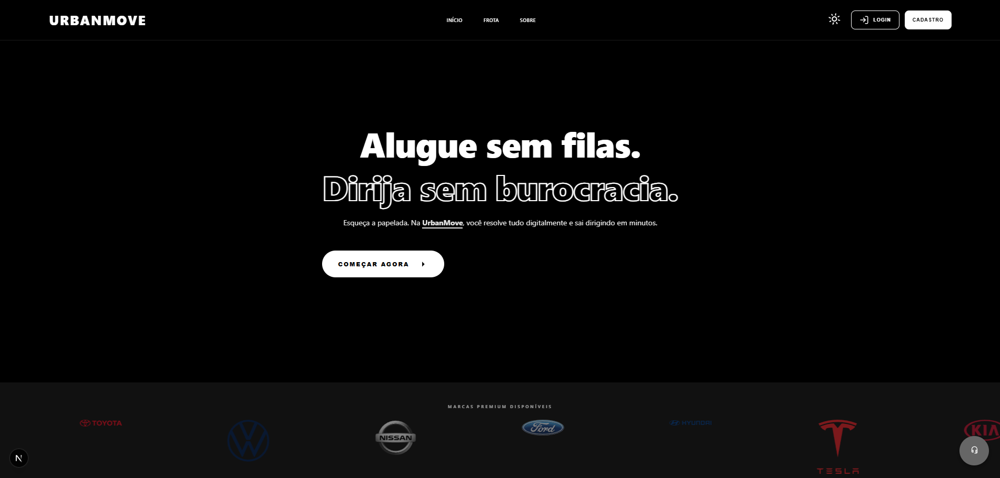</img>

- Modo Claro:

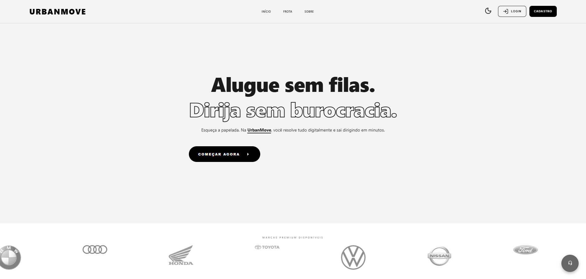</img>

1.1 Assistente 24hrs:

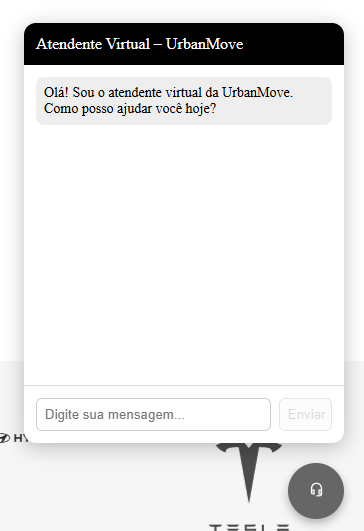</img>

## 2. Login:

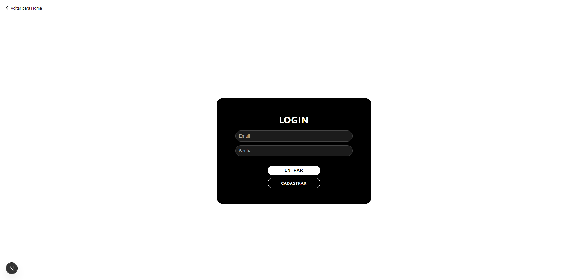</img>

## 3. Cadastro:

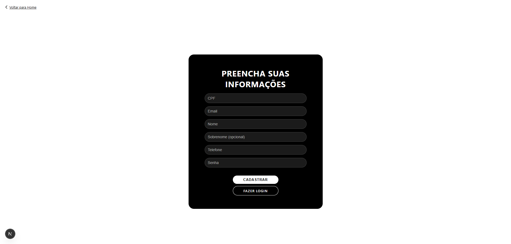</img>

## 4. Home:

- Cliente da Locadora:

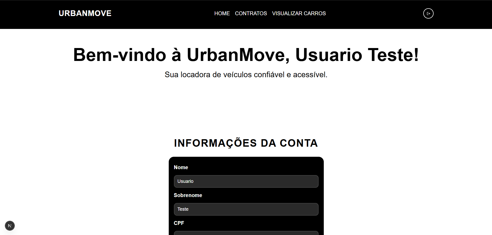</img>

- Administrador:

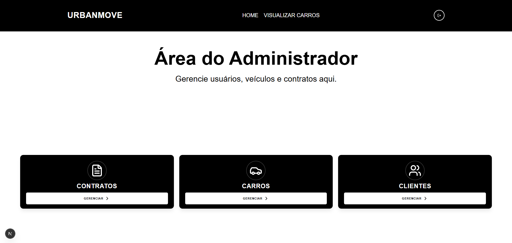</img>

## 5. Visualizando Carros:

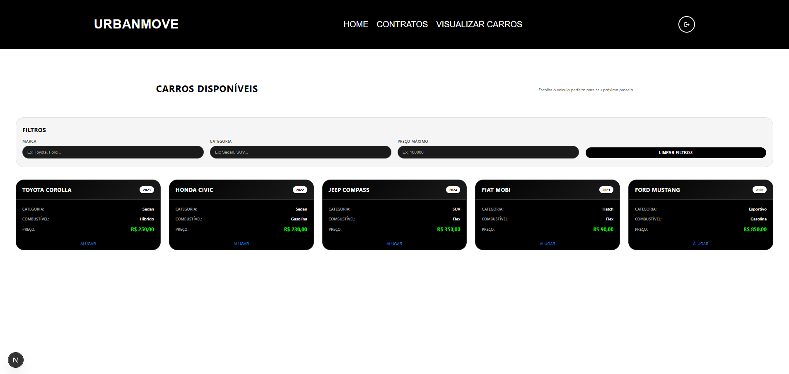</img>

## 6. Gerência:

- Carros:

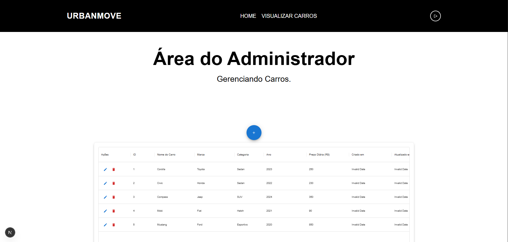</img>

- Clientes:

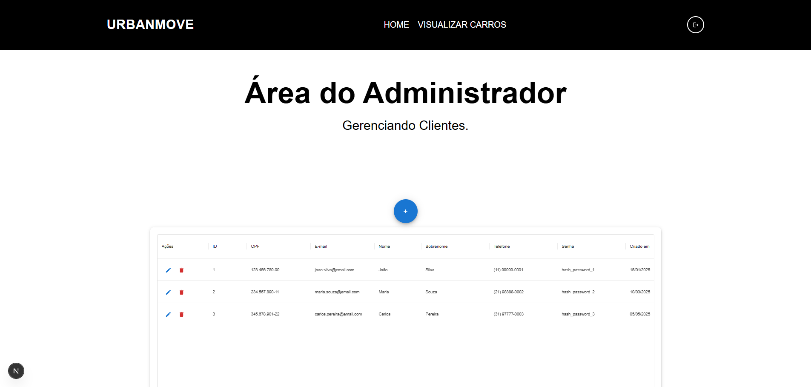</img>

- Contratos:

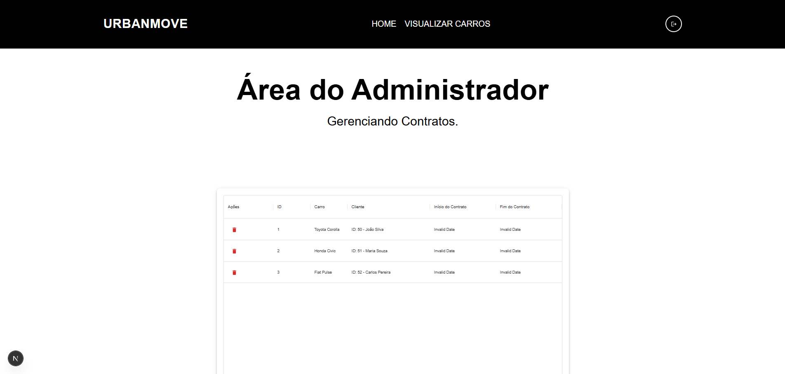</img>

---

## ⚙ Informações sobre Dependências

- Versão do NodeJS: *v22.20.0 (LTS)*

